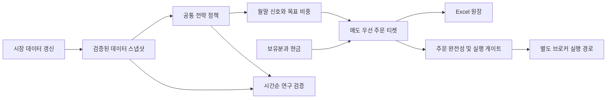

# US-Robust Live Ops

미국 대형주 팩터 전략의 연구와 월간 운용 절차를 Python으로 구현한 개인 프로젝트입니다. 시장 데이터를 갱신하고 월말 신호로 종목과 목표 비중을 계산한 뒤, 주문 티켓과 Excel 원장을 만듭니다. 같은 전략을 시간순으로 평가하는 연구 코드도 함께 관리합니다.

데이터 업데이트, 팩터 선정, 손익 회계, 통계 검증, 운용 자료 작성이 어떻게 연결되는지 코드와 산출물로 확인할 수 있습니다. Python이 계산을 맡고 Excel은 결과를 보여줍니다.

**검증 상태:** Python 3.11 새 환경에서 전체 테스트 **78개 통과, 1개 건너뜀**. TypeScript 타입 검사와 `tsx src/harness.ts` 통과. 실제 브로커 체결과 실계좌 수익률은 검증하지 않았습니다.

## 구현 범위

| 작업 | 구현 내용 | 확인할 코드와 산출물 |
|---|---|---|
| 시장 데이터 갱신 | 유니버스, 종가, 시가, 거래량, SPY를 한 버전으로 저장. 날짜와 종목 범위가 맞을 때만 새 버전을 게시 | [데이터 로더](ops/us_hybrid_backtest.py), [캐시 실패 테스트](tests/test_ops_live_safety.py) |
| 팩터 연구 | 가격 모멘텀과 저변동성 신호를 계산하고 연구와 운용에서 종목 자격, 선정, 비중 정책을 공유 | [팩터 계산](ops/us_factor_research.py), [공통 정책](ops/ops_us_policy.py) |
| 성과 검증 | 시가 체결, 실제 매매금액 기준 비용, 보유 비중 드리프트, 구간말 청산을 반영. IS/OOS와 월별 초과수익 검정 | [검증 엔진](research/walk_forward_validation.py), [회계 및 시간순 검증 테스트](tests/test_walk_forward_validation.py) |
| 운용 자료 작성 | 선정 종목, 보유분, 매도 우선 주문 티켓, 데이터 상태, 주간 NAV를 7개 Excel 시트에 표시 | [Excel 생성](ops/ops_excel_write.py), [워크북 템플릿](results/ops_excel/US_Robust_Ops_Template_v1.xlsx) |
| 주문 전 점검 | 가격이나 수량이 없는 주문, 누락된 주문, 현금 부족, 잘못된 계좌, 재실행 위험을 차단 | [실행 게이트](ops/ops_execute_gates.py), [실행 절차](ops/ops_execute.py) |

## 검토 순서

1. [공통 정책](ops/ops_us_policy.py): 전략 규칙과 운용 목표 비중을 확인합니다.
2. [검증 엔진](research/walk_forward_validation.py): 학습 구간과 평가 구간의 분리, 시가 예산, 거래비용 계산을 확인합니다.
3. [테스트](tests/test_walk_forward_validation.py): 미래 가격을 바꿔도 이전 선택이 유지되는지, NAV와 수익률이 일치하는지 확인합니다.
4. [Excel 생성 코드](ops/ops_excel_write.py): Python 결과가 운용 자료로 옮겨지는 과정을 확인합니다.
5. [검수 후 수정 기록](docs/audit_fixes.md): 발견한 결함, 수정 방법, 회귀 검증을 확인합니다.

## 전략 규칙

전략명은 `Robust_L60_M63_LV20`이며 2026-07-19에 동결한 규칙을 사용합니다.

| 구성 | 비중 | 선정 기준 |
|---|---:|---|
| Leader | 60% | 가격 모멘텀, 고점 근접도, 거래량 변화 등을 합친 순위 점수로 10종 선정 |
| Mom63 | 20% | 최근 63거래일 모멘텀을 기준으로 10종 선정 |
| LowVol | 20% | 가격 추세와 유동성 조건을 만족하는 저변동성 종목 12종 선정 |

각 구성 안에서 동일비중을 적용합니다. 한 종목의 합산 비중은 15%를 넘지 않으며, 선정할 종목이 없거나 상한 적용 후 남는 비중은 현금으로 둡니다. 섹터 40% 상한은 매핑이 있을 때 점검하는 진단 항목입니다.

운용 유니버스는 현재 S&P500 구성종목의 유동성으로 만든 메타데이터를 사용하며 기본 크기는 150종입니다. 월말 신호 시점까지 유효 종가가 200개 이상인 종목을 대상으로 선정합니다. 과거 구성종목을 복원한 PIT 유니버스는 아닙니다.

월말 종가로 신호를 확정하고 다음 거래일 시가에 리밸런싱합니다(`NEXT_OPEN`). 수동 위험모드 `NORMAL/L1/L2`를 주문 티켓에 반영하며 L2는 명시적으로 초기화하기 전까지 유지합니다.

## 데이터와 운용 흐름


```mermaid
flowchart LR
    D[시장 데이터 갱신] --> V[검증된 데이터 스냅샷]
    V --> P[공통 전략 정책]
    P --> M[월말 신호와 목표 비중]
    B[보유분과 현금] --> O[매도 우선 주문 티켓]
    M --> O
    O --> E[Excel 원장]
    O --> G[주문 완전성 및 실행 게이트]
    G --> A[별도 브로커 실행 경로]
    V --> R[시간순 연구 검증]
    P --> R
```

`refresh`는 메타데이터와 가격 묶음을 `data/us/snapshots/<id>/`에 준비합니다. 날짜, 종목, 커버리지를 검사하고 SHA256을 기록한 뒤 `current_snapshot.json`을 교체합니다. 다운로드나 검증이 실패하면 기존 버전을 계속 사용합니다. 월간 운용과 연구는 실행 시작 시 읽은 버전에 고정합니다.

월간 산출물은 `results/ops_runs/YYYY-MM/`의 `signals.csv`, `target.csv`, `orders_preview.csv`, `health.json`입니다. 신호와 목표 비중의 해시는 패키지 매니페스트로 확인합니다. `rebalance`는 저장된 목표를 다시 선정하지 않고 현재 보유분으로 티켓을 만듭니다. 기존 패키지를 다루는 명령은 최신 완료 패키지를 기본으로 선택합니다.

Excel은 `00_Config_Log`부터 `06_Weekly_Trend`까지 7개 시트로 구성합니다. 보유분, 선정 종목, 데이터 상태, 주문 티켓, 주간 NAV를 표시하며 알파와 목표 비중을 다시 계산하지 않습니다. `03_Results`에 가상의 실계좌 성과를 넣지 않습니다. [상세 구조와 시트 설명](docs/architecture.md)

주간 NAV는 NYSE 달력의 마지막 거래일과 실제 장 종료 시각을 기준으로 기록합니다. 휴장과 조기 종료를 반영하며 금요일 종가가 빠졌다고 화요일이나 목요일을 주간 종료일로 간주하지 않습니다. 입출금이 있는 계좌의 단순 NAV 변화율은 입출금을 조정한 투자 수익률과 다릅니다.

## 연구 방법과 검증 범위

| 모드 | 학습 구간 사용 | 다음 평가 구간 |
|---|---|---|
| `fixed` | 60/20/20 정책을 고정. 확장하는 IS는 진단용이며 재학습하지 않음 | 2024-01부터 2026-06까지 6개월씩 5개 OOS Fold |
| `candidate` | 2019-08부터 확장하는 IS에서 4개 후보의 SPY 대비 일별 초과수익 정보비율로 선택. 동률은 전략명 순서 | 선택 이후의 6개월을 평가하고 같은 절차를 5회 반복 |

회계 엔진은 기존 보유분을 체결일 시가로 평가합니다. 매수와 매도 금액에 각각 5bp를 적용해 왕복 10bp 비용을 반영하며, 각 Fold는 현금에서 시작해 마지막 종가에 청산합니다. 이 연결 성과는 Fold 경계에서 포지션을 유지하는 연속 계좌 성과와 다릅니다.

고정 전략은 30개월의 SPY 대비 월별 초과수익에 양측 t검정을 적용하고 IID Bootstrap과 4개월 순환 Block Bootstrap을 각각 10,000회 수행합니다. 국면은 전일 종가까지의 SMA200 추세와 RV21을 기준으로 구분합니다. 후보 선택은 IS 수익률만 받도록 구성했습니다.

수익률 재계산과 합성 데이터 검증은 코드의 회계, 시간 순서, 오류 차단을 확인합니다. 생존편향이나 후보 설계 과정의 선택 편향을 제거하지는 않습니다. SPY는 비용 차감 전 종가 수익률로 비교하며 무위험수익률은 0입니다. 호가 스프레드, 슬리피지, 시장충격과 독립 사후 실적은 별도로 검증해야 합니다.

### 보관된 연구 결과

아래 수치는 수정 전 커밋 `f0bcd3e`에 보관된 연구 기록입니다. 현재 구성종목 기반 149종 캐시를 사용한 사후 실험이며 실제 운용 수익률이 아닙니다. 특히 이전 fixed 경로의 252개 관측값 조건과 월별 유동성 재순위는 운용 정책과 달랐습니다. 현재 코드는 두 정책을 통일했지만 원본 가격과 메타데이터 캐시가 없어 수정된 정책의 시장 성과를 재산출하지 못했습니다.

| 보관 결과 | 기간 | CAGR | Sharpe | MDD | 해석 |
|---|---|---:|---:|---:|---|
| [이전 fixed 검증](results/fixed_strategy_validation/README.md) | OOS 2024-01 ~ 2026-06 | 99.91% | 2.31 | -22.14% | 수정 전 입력 정책의 연구 기록 |
| [후보 선택 WFA](results/walk_forward_validation/README.md) | OOS 2024-01 ~ 2026-06 | 98.08% | 2.25 | -22.02% | 후보를 선택하는 사후 실험 |
| 구형 고정 전략 | 전체 2019-08-01 ~ 2026-06-29 | 49.0% | 1.54 | -30.4% | 당일 종가를 시가 주문 예산에 사용한 회계 오류로 폐기 |

<details>
<summary>보관 결과의 통계와 확인 범위</summary>

이전 fixed와 candidate 결과는 각각 625개 OOS 세션으로 구성하며 5개 Fold 모두 SPY 대비 초과수익을 기록했습니다. 일별 CSV와 JSON의 산술을 harness로 확인합니다. [fixed 상세 수치](results/fixed_strategy_validation/metrics.json), [candidate 상세 수치](results/walk_forward_validation/metrics.json)

이전 fixed의 월별 초과수익은 30개월 평균 4.50%, t=3.8571, 양측 p=0.000589입니다. 월평균 초과수익의 95% Bootstrap 구간은 IID 2.34%~6.73%, Block4 1.93%~7.16%였습니다. Bootstrap에서 평균이 양수인 비율은 p값이 아닙니다.

국면별 일평균 초과수익은 상승·고변동 +0.335%, 상승·저변동 +0.161%, 하락·고변동 -0.075%이며 하락·저변동 표본은 없었습니다. [국면별 표](results/fixed_strategy_validation/regime_table.csv)와 [신호 및 목표 비중](results/fixed_strategy_validation/target_audit.json)을 함께 보관합니다.

월별 t검정은 표본 독립성을 가정합니다. Block Bootstrap은 일부 시간 의존과 표본 민감도를 점검하며 생존편향이나 선택 편향을 교정하지 않습니다. 역사적 섹터 매핑과 운용자의 수동 위험모드는 보관 fixed 실험에 적용하지 않았습니다.

구형 결과의 정보비율은 1.37로 기록돼 있으나 검증 근거로 사용하지 않습니다. 해당 `run_portfolio`, `run_strict`, `strict_asif_test.simulate`와 연구 CLI는 실행을 차단했습니다. 구형 `walk_forward`는 학습 없는 구간별 집계였습니다. 현재 연구 회계는 `research.walk_forward_validation.simulate`를 사용합니다.

</details>

## 검수와 회귀 검증

코드 검수에서 연구와 운용의 종목 자격 불일치, 주문 누락 후 게이트 통과, 구형 회계 오류 등을 재현했습니다. 가격이나 수량을 정하지 못한 주문은 전체 티켓을 차단하고, 전송 목록이 원래 주문과 일치하는지도 검사하도록 고쳤습니다. 연구와 운용은 같은 순수 정책 함수를 사용하며 브로커 보유분과 가격 패널은 실행 컨텍스트로 전달합니다.

캐시 게시 실패, 불완전한 WFA 종료 구간, 주중 NAV 기록, 현재 월 패키지 오선택, 누락 의존성, 이전 브로커 상태 잔류까지 9개 결함을 수정했습니다. 재현 조건과 수정 내용을 [검수 후 수정 기록](docs/audit_fixes.md)에 정리했습니다.

전체 테스트는 **78 passed, 1 skipped**입니다. 네트워크와 브로커 주문을 사용하지 않고 합성 패널, 임시 캐시, Excel 픽스처로 검증합니다. 두 WFA 모드는 실제 main 함수에서 정상 NYSE 5개 Fold를 끝까지 실행하고, 2026-06-30이나 내부 세션이 빠진 캐시는 거부하는지 확인합니다.

## 검증 실행

Python 3.11과 Node.js가 필요합니다. Windows PowerShell 기준이며 직접·간접 Python 의존성은 [requirements-lock.txt](requirements-lock.txt)에 고정했습니다. 시장 가격 캐시와 API 키가 없어도 테스트를 실행할 수 있습니다.

```powershell
$env:PYTHONUTF8 = '1'
python -m venv .venv
.\.venv\Scripts\python.exe -m pip install -r requirements.txt
.\.venv\Scripts\python.exe -m pip check
npm ci
$env:VALIDATION_PYTHON = (Resolve-Path .\.venv\Scripts\python.exe).Path
npm run check
npx tsx src/harness.ts
```

Harness는 보관 CSV/JSON의 625세션, 30개월, 5개 Fold를 재계산하고 현재 Python 전체 테스트를 실행합니다. TypeScript 코드는 엄격한 타입 검사를 적용합니다.

시장 데이터로 연구를 다시 실행하려면 같은 스냅샷의 가격 4개와 유니버스 메타데이터가 필요합니다. 캐시는 저장소에 포함하지 않습니다. 재다운로드한 데이터가 보관 결과의 원본과 같다는 보장은 없습니다.

```powershell
.\.venv\Scripts\python.exe research/walk_forward_validation.py --mode fixed --data-dir data/us
.\.venv\Scripts\python.exe research/walk_forward_validation.py --mode candidate --data-dir data/us
```

## 저장소 구성과 운용 명령

```text
ops/       공통 정책, 데이터 로더, 월간 티켓, 실행 게이트, Excel, 주간 원장
research/  시간순 성과 검증과 연구 산출물 생성
tests/     회계, 시간 순서, 캐시, 주문, 원장 회귀 검증
src/       TypeScript 산출물 검증 harness
results/   보관 연구 결과와 Excel 템플릿
docs/      전략 명세, 구조 설명, 검수 기록
```

브로커 조회 없이 상태만 확인하려면 다음 명령을 사용합니다.

```powershell
.\.venv\Scripts\python.exe ops.py status --no-toss-probe --positions none --no-xlsx
```

운용은 `refresh → monthly → rebalance` 순서입니다. 브로커 연동은 `.env`에서 읽으며 주문 실행은 별도 `execute` 명령과 위험모드 선택이 필요합니다. [전체 명령과 실주문 조건](COMMANDS.md), [Toss API 확인 현황](docs/toss_order_api_research.md)을 참고하세요. 브로커 API와 실체결 검증은 완료된 것으로 주장하지 않습니다.

MIT 라이선스의 개인 연구 프로젝트입니다. 과거 연구 성과를 미래 수익이나 검증된 실계좌 성과로 해석할 수 없습니다.
