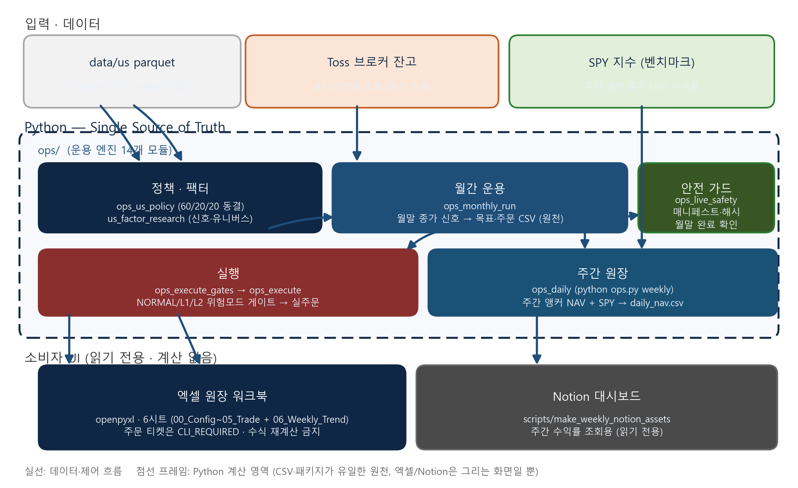

# US-Robust Live Ops

미국 대형주(SPY 벤치마크) 3-슬리브 퀀트 전략을 **월간 리밸런스로 실제 운용하는 라이브 옵스 시스템**입니다. 신호와 목표 비중은 Python이 유일한 원천(source of truth)이고, openpyxl로 만드는 엑셀 원장과 Notion 대시보드는 읽기 전용 소비자로 분리했습니다. 데스크에서 엑셀을 직접 고치다 생기는 수식 오염, 원장 어긋남 같은 실수를 구조적으로 막는 게 이 저장소의 핵심입니다.

- 전략: `Robust_L60_M63_LV20` (Leader 60% / Mom63 20% / LowVol 20%, 동일비중)
- 리밸런스: 월말 종가 신호 -> 익영업일 시가 체결 (NEXT_OPEN)
- 종목: S&P500 유동성 상위 150 (이름 상한 15%)
- 원장: 월별 주간 NAV 앵커 + SPY 비교 (06_Weekly_Trend)
- 규모: Python 약 17k LOC, 모듈 27개, fail-closed 테스트 45개

## 왜 이런 구조인가

퀀트 데스크 운영에서 가장 위험한 지점은 "엑셀에서 뭔가를 고쳤다"입니다. 수식 하나가 잘못 복사되면 P&L이 조용히 틀어지고, 그걸 나중에 발견하기 어렵습니다. 이 저장소는 계산을 전부 Python에 두고, 엑셀/Notion은 결과를 그려주는 화면으로만 씁니다.

- Python CSV/패키지가 주문·NAV 원천. 엑셀은 `CLI_REQUIRED`만 표시하고 주문을 만들지 못함
- 매 실행이 마스터 템플릿에서 원장 워크북을 다시 생성. 병합 셀이나 샘플 잔고가 섞일 여지가 없음
- 패키지 매니페스트(SHA256)로 신호·목표 위변조를 실행 전에 감지
- 실주문은 `ops.py execute` + 명시적 위험모드(NORMAL/L1/L2)에서만 통과

## 확장형 Walk-Forward 검증

기존 후보 전략 4개를 대상으로 과거 학습 구간의 정보비율만으로 전략을 선택하고, 다음 6개월을 평가하는 절차를 5회 반복했습니다. 학습은 2019년 8월부터 확장하며 평가 기간은 2024년 1월부터 2026년 6월까지입니다. 각 평가 구간의 결과는 그 구간의 전략 선택에 사용하지 않습니다.

- 학습 기준: SPY 대비 일별 초과수익의 정보비율, 동률이면 전략명 순서
- 체결 및 비용: 월말 신호 후 익영업일 시가, 왕복 10bp; 각 구간의 진입과 종료 청산 비용 반영
- 결과: 5개 평가 구간 모두 SPY 대비 초과수익. 연결 수익률의 연환산 98.08%, 샤프 2.25, 최대 낙폭 -22.02%
- 구분: 아래 수치는 후보를 다시 선택하는 절차의 결과이며, 고정 60/20/20 운용 전략의 성과가 아닙니다.

[검증 결과와 구간별 표](results/walk_forward_validation/README.md) | [상세 수치](results/walk_forward_validation/metrics.json) | [검증 코드](research/walk_forward_validation.py)

이 실험은 이미 연구한 후보 정의와 현재 구성종목 기반 캐시를 사용한 사후 재검증입니다. 시간순 선택 절차를 적용했지만 후보 설계의 사후 선택 가능성과 생존편향은 남아 있으며, 실시간 운용 성과를 뜻하지 않습니다. 기존 IID/Block Bootstrap 및 파라미터 민감도 분석은 별도 고정 전략 연구입니다.

```bash
# 기존 로컬 가격 캐시 4개가 필요하며 네트워크와 주문 기능을 호출하지 않습니다.
python research/walk_forward_validation.py
python -m unittest discover -s tests -p test_walk_forward_validation.py -v
```

## 기존 고정 전략 결과와의 구분

기존 결과 파일의 전체 평가 기간은 **2019-08-01 ~ 2026-06-29**이며 연환산 49.0%, 샤프 1.54, 정보비율 1.37, 최대 낙폭 -30.4%로 기록돼 있습니다. 이전 README의 2024-01 ~ 2026-07 표기는 잘못된 기간이어서 바로잡았습니다.

기존 엔진은 리밸런싱 예산에 당일 종가를 사용하는 문제가 확인됐으므로, 해당 숫자는 과거 산출물 기록으로만 남깁니다. 새 검증 엔진은 시가로 기존 보유분을 평가하고 실제 보유 비중 변화에 비용을 적용합니다. 새 결과를 과거 보고서의 수치와 섞어 사용하지 않습니다.

## 아키텍처



Python(ops/)이 신호·비중·NAV 계산의 유일한 원천이고, 엑셀 원장과 Notion은 결과를 그려주는 소비자다. 자세한 설명은 [docs/architecture.md](docs/architecture.md)를 참고.

## 저장소 구조

```text
ops/                 # 운용 엔진 (14 모듈)
  ops_us_policy.py     동결 정책 (60/20/20, 이름 상한, NEXT_OPEN)
  ops_monthly_run.py   월간 신호 -> 목표 -> 주문 -> health
  ops_excel_write.py   openpyxl 원장 워크북 생성
  ops_daily.py         주간 NAV/SPY 앵커 기록
  ops_execute*.py      실주문 게이트 + 실행
  toss_*.py            브로커 잔고 조회 / 주문 클라이언트
  us_*.py              팩터 연구 + 백테스트 로더
scripts/             # 엑셀 템플릿 생성, Notion 주간 자산
research/            # 엄격 백테스트 검증 + 한글 보고서 생성
tests/               # fail-closed 안전 테스트 (네트워크 차단)
docs/                # 전략 명세, 아키텍처
```

아키텍처 다이어그램과 시트별 설명은 [docs/architecture.md](docs/architecture.md)에 있습니다.

## 빠른 시작

```bash
python -m pip install -r requirements.txt
python -m pytest tests/ -q          # hermetic, 네트워크 없음

# 데이터 갱신 후 월간 운용 절차
python ops.py refresh
python ops.py monthly               # 신호 -> 목표 -> 주문 티켓 -> 엑셀
python ops.py rebalance             # 동결 목표 + 실시간 잔고로 티켓 재구성
python ops.py execute --risk-mode NORMAL   # 게이트 통과 후 실주문(선택)
python ops.py weekly                # 주간 NAV + SPY 스냅샷 (금요일 앵커)
```

브로커 연동(Toss OpenAPI)은 `.env`에 키를 넣고 `ops_env.load_env()`로 읽습니다.
`refresh`는 데이터를 만들어 `data/us/`에 parquet으로 저장합니다. 전체 커맨드는
[COMMANDS.md](COMMANDS.md)를 보세요.

## 테스트 철학

`tests/test_ops_live_safety.py`는 라이브 호출을 전부 차단합니다(HTTP 금지
fixture). 엑셀 READY 경로는 `tests/fixtures/us_prices_fixture.parquet` 같은
결정적 픽스처만 써서, 저장소를 새로 받아도 같은 결과가 나옵니다. 그래서
"게이트를 우회하면 안 된다"가 아니라 "게이트가 실제로 막는지"를 코드로 검증합니다.

## 라이선스와 책임

MIT 라이선스로 공개합니다. 이 코드는 개인 연구·운용 프로젝트이며, 실제 투자에
쓰는 결정과 그 결과의 책임은 전적으로 운영자에게 있습니다.
