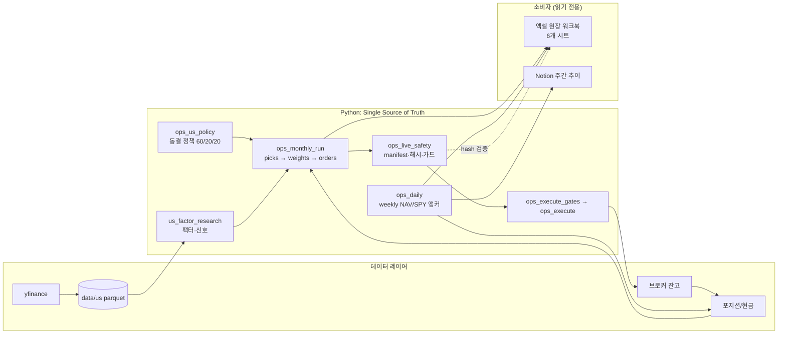

# 아키텍처

## 한눈에 보기

```
                       ┌────────────────────────────────────────────────┐
                       │              Python (Source of Truth)         │
                       │                                                │
  data/us parquet ◄────┤  us_hybrid_backtest / us_factor_research       │
  (refresh)            │      (팩터·신호·유니버스)                        │
                       │         │                                      │
                       │  ops_us_policy (동결 정책 60/20/20)             │
                       │         │                                      │
                       │  ops_monthly_run  ──► signals/target/orders CSV │
                       │         │                                      │
                       │  ops_live_safety (manifest·해시·fail-closed)    │
                       │         │                                      │
                       │  ops_execute_gates → ops_execute ──► broker     │
                       │         │                                      │
                       │  ops_daily (weekly NAV/SPY 앵커)                │
                       └────────┬───────────────────────────────────────┘
                                │ (CSV가 유일한 원천; 수식 재계산 없음)
                    ┌───────────▼───────────┐     ┌──────────────────┐
                    │  Excel 승인/원장 UI     │     │  Notion 주간 조회   │
                    │  openpyxl 6시트 워크북  │     │  (make_weekly_*)  │
                    └───────────────────────┘     └──────────────────┘
```

## 데이터 흐름



## 계층

| 계층 | 모듈 | 책임 |
|---|---|---|
| 엔진/정책 | `ops_us_policy.py` · `us_factor_research.py` · `research/us_robust_strategy.py` | 동결된 슬리브 정책과 팩터 신호 |
| 데이터 | `us_hybrid_backtest.py` | yfinance 패널 다운로드·캐시·백테스트 공용 로더 (운용 가중치 `W_*`는 import 금지) |
| 월간 운용 | `ops_monthly_run.py` | 신호일 선택 → 슬리브 선정 → 동일비중 60/20/20 → 주문 티켓 → health |
| 실행 | `ops_execute.py` · `ops_execute_gates.py` | 패키지 해시/가드 통과 후 실주문 (LIVE 스위치) |
| 원장/주간 | `ops_daily.py` | 주간 앵커(ISO 주 마지막 미국 거래일) NAV + SPY 스냅샷 |
| 브로커 | `toss_portfolio.py` · `toss_orders.py` | 잔고 조회(읽기 전용) · 주문 클라이언트 |
| UI | `ops_excel_write.py` · `scripts/` | openpyxl 6시트 원장 워크북 · Notion 자산 생성 |

## 원장 UI (엑셀 6시트)

`results/ops_excel/US_Robust_Ops_Template_v1.xlsx` 를 마스터로, 매 실행마다
`results/ops_runs/YYYY-MM/US_Robust_Ops_YYYY-MM.xlsx` 로 재생성된다.

| 시트 | 내용 |
|---|---|
| 00_Config_Log | 실행 설정·감사 로그 |
| 01_Portfolio_Now | 현재 포지션 (Python CSV가 원천) |
| 02_Screen_Select | 슬리브별 선정 종목 |
| 03_Results | 신호·목표·성과 요약 |
| 04_Health | health.json 반영 (BLOCK/WARN/OK) |
| 05_Trade | 매도 우선 주문 티켓. `CLI_REQUIRED`, 주문 원천은 CSV |

핵심 설계 원칙: **엑셀/Notion은 소비자**다. 모든 계산(앵커 선택, 백필, 재계산,
압축)은 Python에 있고, 엑셀에서 알파·비중을 재계산하지 않는다. 템플릿의 병합
셀·데모 행·샘플 잔고가 운영 워크북으로 새어들지 않도록 라이브 시트(01/02/05)는
매번 처음부터 다시 그린다.

## weekly 흐름

- 앵커 = ISO 주의 마지막 미국 거래일(보통 금요일)
- Mon-Thu 실행: no-op (`not_weekly_anchor_day`)
- 금요일: 라이브 스냅샷 기록
- 토/일 실행: 직전 금요일 앵커 행을 그 자리에서 덮어씀
- 빠뜨린 주는 다음 앵커 실행 때 백필 (cum_ret 연속 유지)
- 파일명은 호환성을 위해 `daily_*` 유지 (행 밀도는 주간)

## fail-closed 안전장치

- 패키지 매니페스트(SHA256)로 신호/목표 위변조 감지
- 월말 종가 완료 전 월간 실행 거부 (`--force-intramonth`는 연구 전용)
- 실주문은 `ops.py execute` + 명시적 위험모드(NORMAL/L1/L2)에서만
- 초과 주문/계좌 고정/미체결 주문/매도수량 검증 게이트
- 테스트는 순수 함수 + 차단된 HTTP (라이브 네트워크 금지)

## 운용 유의

- 백테스트 유니버스(119종)와 라이브 유니버스(상위 150종)는 다르다.
- 과거 성과는 미래 수익을 보장하지 않는다. 실제 운용 리스크는 운영자 책임이다.
